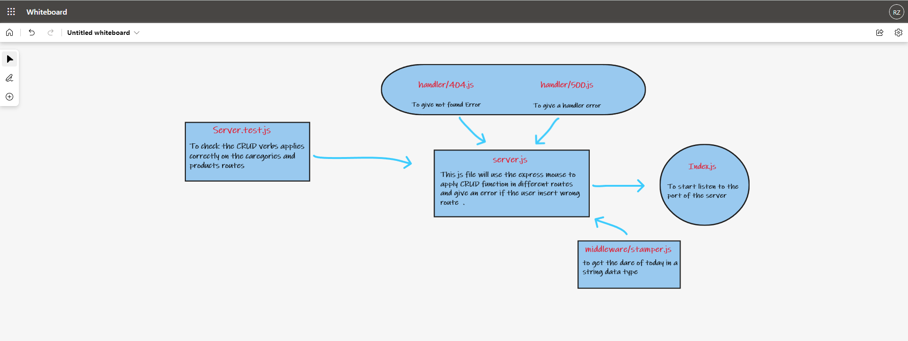

# server-deployment-practice

## Author: Rami Zregat

## Project: Node Ecosystem, CI, CD

## Lab 1

**Description of today lab:**  
Today we will  create and deploy a web server using CI and CD and get used to the general process of building and deploying servers.

## Links to check:
- Heroku application for dev branch: https://ramizregat-server-deploy-dev.herokuapp.com/

- Heroku application for main branch: https://ramizregat-server-deploy-prod.herokuapp.com/

- Github actions link: https://github.com/RamiZregat/server-deployment-practice/actions

- Github pull request link: https://github.com/RamiZregat/server-deployment-practice/pull/6

## Dependencies:
- express
- jest
- dotenv
- supertest

## How to start the server:  
- npm start
- nodemon

## What should I run on the terminal or postman?
- GET: http://localhost:3030/
- GET: http://localhost:3030/data
- GET: http://localhost:3030/bad

## UML

